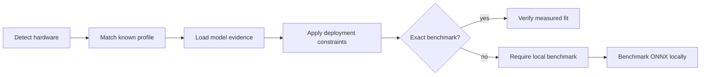

# AutonomyFit


[](https://github.com/sylvesterkaczmarek/autonomyfit/actions/workflows/ci.yml)


AutonomyFit scans a machine, identifies accelerator and runtime capabilities, and ranks edge-AI models against memory, latency, throughput, accuracy, and power constraints. It separates published measurements from screening estimates so an unmeasured deployment constraint cannot silently pass.

## At a glance

```text
$ autonomyfit recommend --hardware-profile jetson-orin-nx-16gb --fps 200 --latency-ms 5

Model       Verdict         Runtime          Memory       Latency    FPS
YOLO26n     VERIFIED_FIT    tensorrt/fp16    1.00 GB est  4.13 ms    242.1
YOLO26s     BENCHMARK_REQUIRED ...
```

The bundled `YOLO26n` Jetson result above uses an upstream benchmark for the exact hardware/runtime/precision tuple. Candidates without a matching measurement are marked `BENCHMARK_REQUIRED` when a performance constraint is present.



## Why this is useful

Choosing a model for a robot, drone, embedded vision system, or other autonomous platform is usually a cross-check across several separate sources. AutonomyFit puts the first screening pass in one CLI:

- local CPU, RAM, NVIDIA GPU, Apple Silicon, and Jetson detection
- runtime readiness for ONNX Runtime, PyTorch, TensorRT, Core ML, and Transformers
- model ranking for object detection and vision-language workloads
- published benchmark matching for known hardware tuples
- explicit handling of unknown latency, FPS, and power evidence
- local ONNX latency benchmarking with deterministic synthetic inputs
- optional power sampling on supported NVIDIA and Jetson systems
- custom JSON model catalogs for project-specific candidates

AutonomyFit does not download model weights.

## Fit decisions

AutonomyFit uses five outcomes.

| Outcome | Meaning |
|---|---|
| `VERIFIED_FIT` | Available evidence for the exact profile satisfies the requested constraints. |
| `FEASIBLE` | Hardware and memory screening passes and no unverified performance constraint was requested. |
| `BENCHMARK_REQUIRED` | Memory screening passes, but latency, FPS, or power needs a measurement on the target device. |
| `CONSTRAINT_FAIL` | A measured or catalogued constraint is violated. |
| `NO_FIT` | A hard compatibility or memory screen fails. |

Published values remain tied to their source hardware. A T4 number is never treated as a Jetson number, and a Jetson Orin NX measurement is never treated as an arbitrary NVIDIA GPU measurement.

## Quick start

```bash
python -m venv .venv
source .venv/bin/activate
pip install -e .

autonomyfit
```

Scan the current machine:

```bash
autonomyfit scan
```

Rank detection models against local hardware:

```bash
autonomyfit recommend --task detection --fps 30 --latency-ms 40
```

Evaluate a known Jetson target before you have access to the device:

```bash
autonomyfit recommend \
  --hardware-profile jetson-orin-nx-16gb \
  --task detection \
  --fps 200 \
  --latency-ms 5
```

Rank compact vision-language models:

```bash
autonomyfit recommend --task vlm
```

List bundled model and hardware profiles:

```bash
autonomyfit catalog
autonomyfit profiles
```

## Local benchmark

Install the optional benchmark dependencies:

```bash
pip install -e '.[benchmark]'
```

Benchmark a local ONNX model on the actual machine:

```bash
autonomyfit benchmark model.onnx --iterations 100 --warmup 20 -o result.json
```

For a dynamic image input, provide the concrete tensor shape:

```bash
autonomyfit benchmark model.onnx --shape 1,3,640,640
```

The benchmark reports mean, p50, p95 and p99 latency, derived FPS, ONNX Runtime provider, input shape, and mean sampled power when a supported platform power reader is available. Inputs are deterministic random tensors and are intended for execution-cost measurement, not task accuracy validation.

## Evidence model

Bundled object-detection metadata comes from the current Ultralytics YOLO26 model documentation. The repository includes exact Jetson `YOLO26n` latency records only where the upstream table identifies hardware, runtime, and precision. Current bundled Jetson profiles cover AGX Thor, AGX Orin 64GB, Orin Nano Super 8GB, and Orin NX 16GB.

The bundled VLM catalog starts with Hugging Face SmolVLM profiles whose upstream model cards state concrete GPU-memory requirements. Throughput is left unmeasured unless a hardware-specific record exists.

See [docs/evidence.md](docs/evidence.md) for source and interpretation rules.

## Memory screening

When upstream documentation provides a concrete inference-memory figure, AutonomyFit uses it and labels the value `published`. Otherwise it computes a conservative screening estimate from parameter count, precision, and a task-specific overhead allowance.

A screening estimate answers whether a candidate is obviously too large. It is not a replacement for peak-memory profiling on the final workload.

## Custom catalogs

Pass a project-specific catalog without modifying the package:

```bash
autonomyfit recommend --catalog examples/custom-models.json --task detection
```

The schema is documented in [docs/catalog.md](docs/catalog.md).

## Repository layout

```text
autonomyfit/
├── .github/workflows/ci.yml
├── .github/workflows/release.yml
├── assets/social/
├── docs/
│   ├── catalog.md
│   ├── evidence.md
│   └── reproducibility.md
├── examples/custom-models.json
├── scripts/validate_catalog.py
├── src/autonomyfit/
│   ├── benchmark.py
│   ├── catalog.py
│   ├── cli.py
│   ├── hardware.py
│   ├── models.py
│   ├── reporting.py
│   ├── scoring.py
│   └── data/
├── tests/
├── CITATION.cff
├── LICENSE
├── Makefile
├── pyproject.toml
└── README.md
```

## Validation

The test suite covers catalog integrity, hardware-profile matching, memory failure cases, exact benchmark verification, measured constraint failure, unmeasured-performance abstention, power-evidence abstention, parsers, and CLI smoke paths.

```bash
make test
make smoke
```

See [docs/reproducibility.md](docs/reproducibility.md).

## What this repository does not claim

- A catalog fit is not proof that an end-to-end robotic workload meets its deadline.
- Published inference latency does not include every camera, preprocessing, post-processing, communication, or control-loop cost.
- Parameter-derived memory estimates are screening values, not measured peak memory.
- A synthetic ONNX execution benchmark does not validate model accuracy or safety.
- Power varies with clocks, power mode, thermal state, peripherals, concurrent processes, and workload.
- Model weights and runtimes retain their upstream licences and terms. The MIT licence in this repository applies to AutonomyFit code.

## Extending

Useful next additions include more exact hardware/runtime benchmark records, Core ML measurements on Apple Silicon, TensorRT engine benchmarking, camera-pipeline overhead measurement, thermal-soak tests, and task-specific safety margins.

Contributions should preserve the evidence rule: measured values need a traceable source or a reproducible local result, and unknown quantities remain unknown.

## Cite this repository

If you use or adapt this repository, please cite

> Kaczmarek, S. (2026). *AutonomyFit*. GitHub. https://github.com/sylvesterkaczmarek/autonomyfit

```bibtex
@software{Kaczmarek_2026_AutonomyFit,
  author = {Sylvester Kaczmarek},
  title  = {{AutonomyFit}},
  year   = {2026},
  url    = {https://github.com/sylvesterkaczmarek/autonomyfit}
}
```

## License

MIT. See [LICENSE](LICENSE).

© **Sylvester Kaczmarek** · [https://www.sylvesterkaczmarek.com](https://www.sylvesterkaczmarek.com)
