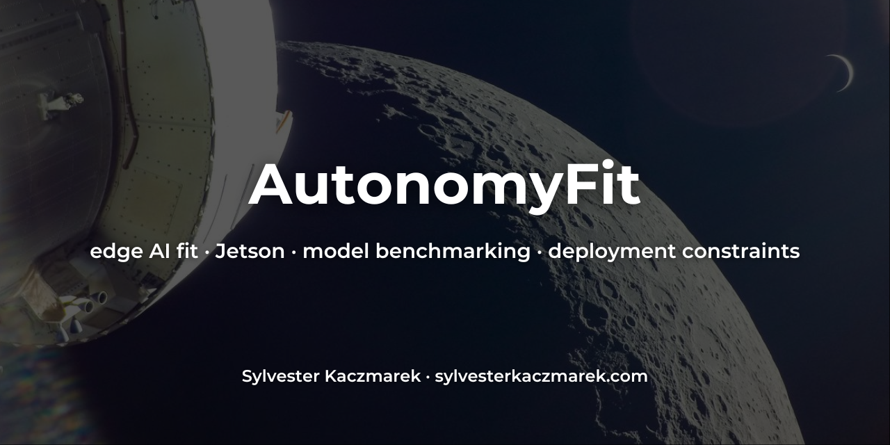

# AutonomyFit



[](https://github.com/sylvesterkaczmarek/autonomyfit/actions/workflows/ci.yml)


AutonomyFit is an evidence-aware deployment assessment CLI for edge AI and autonomous systems. It discovers and ranks models, identifies deployment artifacts without executing repository code, validates runtime compatibility, benchmarks exact artifacts on the current machine, and emits reproducible reports that distinguish measured evidence from estimates and unknowns.

## Install

```bash
pip install autonomyfit
```

For artifact discovery and ONNX structural validation:

```bash
pip install 'autonomyfit[deployment]'
```

For local ONNX Runtime benchmarking:

```bash
pip install 'autonomyfit[benchmark]'
```

Install both for the most complete generic ONNX workflow:

```bash
pip install 'autonomyfit[deployment,benchmark]'
```

TensorRT, OpenVINO, Core ML and PyTorch conversion paths use the vendor/runtime tooling installed on the target machine rather than bundling those large platform-specific stacks into AutonomyFit.

## Five-minute workflow

```bash
autonomyfit scan

autonomyfit recommend \
  --task detection \
  --objective latency \
  --top 3

autonomyfit artifacts smolvlm-256m-instruct

autonomyfit validate MODEL \
  --artifact model.onnx \
  --revision COMMIT \
  --runtime onnx \
  --benchmark \
  --latency-ms 20 \
  --report deployment.json \
  --markdown deployment.md

autonomyfit local-results

autonomyfit compare MODEL1 MODEL2 --objective latency --json
```

`validate` is deliberately conservative. A conversion succeeding does not establish task-level accuracy equivalence, an installed execution provider does not prove operator coverage, and a benchmark without exact model revision and artifact identity does not become `VERIFIED_FIT` evidence.

## Safe artifact handling

AutonomyFit never enables Hugging Face `trust_remote_code` and never executes repository Python during discovery or download. Hugging Face refs are resolved to a full immutable commit SHA before acquisition. When Hub LFS SHA-256 metadata is available, it is checked against the downloaded bytes; AutonomyFit always computes its own artifact digest before admitting an artifact to its managed cache.

Automatic remote acquisition is limited to static formats such as ONNX and safetensors. Pickle-style PyTorch artifacts, repository code, native libraries and serialized TensorRT engines cross an execution boundary and require explicit trust or are refused. TensorRT engines built locally by AutonomyFit are marked as locally trusted and bound to their recorded toolchain.

For OpenVINO IR and Core ML package directories, artifact identity covers every byte-bearing member using a deterministic bundle digest. Changing an OpenVINO `.bin` companion or a member of an `.mlpackage` changes the identity.

Non-standard, restricted or unknown licence status blocks automatic acquisition unless `--allow-restricted-license` is supplied. That flag acknowledges the boundary; it does not grant usage rights or replace the upstream licence terms.

See [docs/deployment.md](docs/deployment.md) and [docs/security.md](docs/security.md).

## Deployment validation

Inspect a model before downloading anything:

```bash
autonomyfit validate smolvlm-256m-instruct
```

Safely discover upstream artifacts and the immutable resolved revision:

```bash
autonomyfit artifacts smolvlm-256m-instruct
```

Fetch one unambiguous safe static artifact:

```bash
autonomyfit validate smolvlm-256m-instruct \
  --fetch \
  --filename model.onnx \
  --runtime onnx \
  --report smolvlm.json
```

Or validate a local artifact with an expected digest:

```bash
autonomyfit validate yolo26n \
  --artifact yolo26n.onnx \
  --revision UPSTREAM_COMMIT \
  --sha256 EXPECTED_SHA256 \
  --runtime onnx \
  --benchmark \
  --latency-ms 10 \
  --fps 100 \
  --report yolo26n-onnx.json
```

A benchmark always refers to the actual machine. `--hardware-profile` is useful for compatibility screening, but AutonomyFit refuses to create local benchmark evidence for a profile that does not match the detected machine.

## Conversion validation

Supported safe conversion paths depend on the installed toolchain:

- ONNX -> TensorRT engine with `trtexec`
- ONNX -> OpenVINO IR with `ovc` or `openvino.convert_model`
- explicitly trusted local TorchScript -> ONNX with `torch.onnx.export`
- explicitly trusted local TorchScript -> Core ML ML Program with `coremltools`

Examples:

```bash
autonomyfit validate yolo26n \
  --artifact yolo26n.onnx \
  --runtime tensorrt \
  --precision fp16 \
  --convert \
  --benchmark
```

```bash
autonomyfit validate MODEL \
  --artifact trusted-model.pt \
  --trust-artifact \
  --shape 1,3,224,224 \
  --runtime onnx \
  --convert
```

For ONNX -> OpenVINO, AutonomyFit attempts a deterministic numeric output comparison when both runtimes expose a compatible generic tensor contract. That check is reported separately from task accuracy and never described as accuracy validation.

## Local evidence and recommendation override

Successful validation benchmarks can be imported automatically into the local-results layer. Exact local measurements outrank generic vendor/reference evidence for the same artifact, hardware, runtime and precision.

```bash
autonomyfit local-results
```

Local evidence is invalidated rather than silently reused when it becomes stale or a material execution identity changes, including hardware identity, OS identity, driver major version, runtime major version, or required ONNX Runtime execution-provider availability.

## Candidate assessment

When exact artifacts are available for several candidates, benchmark them on the current machine and reorder using the measurements:

```bash
autonomyfit assess yolo26n rfdetr-nano \
  --artifact yolo26n=./yolo26n.onnx \
  --artifact rfdetr-nano=./rfdetr-nano.onnx \
  --runtime onnx \
  --json
```

## Deployment reports

Deployment reports include machine and software stack, model/revision, licence metadata, artifact identity, runtime/precision, conversion provenance, compatibility checks, latency distribution, throughput, memory, power/energy where available, registry comparison, recommendation confidence, failed constraints, warnings, timestamps and reproduction commands.

```bash
autonomyfit report deployment.json

autonomyfit report deployment.json -o deployment.md
```

Registry comparisons flag incompatible batch/shape/power-mode/software-stack conditions and classify a comparable latency result as materially slower/faster or within the configured engineering band. That engineering comparison is not presented as a statistical significance test.

## Model selection

AutonomyFit supports ten extensible task categories:

```text
detection  classification  segmentation  pose  depth
ocr        vlm             anomaly       asr   embedding
```

The signed continuous registry contains curated practical families including YOLO26, RF-DETR, RepViT, MobileSAM, Depth Anything V2, PP-OCRv6, SmolVLM2, EfficientAD, Whisper, MobileCLIP and DINOv2.

```bash
autonomyfit recommend --task classification --objective latency
autonomyfit recommend --task detection --objective throughput
autonomyfit recommend --task segmentation --objective memory
autonomyfit recommend --task depth --objective balanced
```

Hard constraints are applied first. Feasible candidates are organized into conservative Pareto layers and then ordered for `latency`, `throughput`, `accuracy`, `power`, `memory` or `balanced`. Missing quantities cannot manufacture Pareto dominance.

See [docs/ranking.md](docs/ranking.md).

## Confidence and evidence

Every recommendation exposes a 0-100 confidence score based on hardware exactness, runtime/precision matching, evidence quality, evidence freshness, revision/artifact identity and requested-quantity coverage. Unresolved requested constraints cap confidence.

Evidence outcomes remain explicit:

| Outcome | Meaning |
|---|---|
| `VERIFIED_FIT` | Exact identity-matched local or standardized evidence satisfies requested constraints. |
| `FEASIBLE` | Hard compatibility and memory screening pass without an unresolved requested performance constraint. |
| `BENCHMARK_REQUIRED` | A requested quantity cannot be defended with exact applicable evidence. |
| `CONSTRAINT_FAIL` | Exact applicable evidence violates a requested threshold. |
| `NO_FIT` | A hard model/runtime/precision/memory/size feasibility condition fails. |

See [docs/evidence.md](docs/evidence.md).

## Hardware and runtimes

First-class profiles cover NVIDIA Jetson and discrete GPUs, Apple Silicon, Intel CPU/GPU/NPU systems, AMD Ryzen AI systems, Qualcomm Snapdragon X Elite and Arm CPU targets. Native benchmark paths include ONNX Runtime, TensorRT, OpenVINO and Core ML where the required tooling exists.

QNN, XNNPACK, OpenVINO EP, CoreML EP, TensorRT EP, CUDA EP and Vitis AI EP are provider capabilities. Provider availability is never represented as proof that a specific graph is fully supported.

See [docs/hardware.md](docs/hardware.md) and [docs/benchmarking.md](docs/benchmarking.md).

## Registry trust

The model registry is independently versioned from the PyPI package. Remote registry updates are schema-validated, Sigstore-verified against the expected GitHub Actions identity, freshness checked and protected against version rollback/content substitution. Offline operation uses previously verified cache or the bundled fallback.

```bash
autonomyfit registry status
autonomyfit registry update
autonomyfit models --offline
autonomyfit search mobileclip
```

See [docs/registry.md](docs/registry.md).

## Current limitations

- Exact deployment evidence is still sparse across the full hardware x runtime x model matrix.
- Many registry entries have source-verified metadata but no immutable upstream revision recorded until an artifact is resolved during deployment validation.
- Generic correctness comparison is only possible for models with compatible deterministic numeric input/output contracts. Task-level accuracy needs a task-specific evaluation dataset and protocol.
- TensorRT engines are not portable evidence across arbitrary TensorRT/CUDA/GPU stacks.
- Core ML conversion requires a trusted source graph and explicit input contract; generic ONNX -> Core ML conversion is intentionally not automated.
- Process RSS is not accelerator memory. Power scope is platform-specific and is reported explicitly.
- AutonomyFit does not adjudicate whether a licence permits a particular commercial or regulated use.

AutonomyFit remains pre-1.0. Stage completion alone is not a release-maturity criterion.

## Development

```bash
git clone https://github.com/sylvesterkaczmarek/autonomyfit.git
cd autonomyfit
python -m venv .venv
source .venv/bin/activate
pip install -e '.[dev]'
make test
make evidence-validate
make smoke
```

CI covers Python 3.10 through 3.13, registry/evidence validation, Ruff, the full test suite, distribution build, `twine check`, installed-wheel smoke tests and signed-registry behavior.

## Cite

> Kaczmarek, S. (2026). *AutonomyFit*. GitHub.

## License

MIT. See [LICENSE](LICENSE).

© **Sylvester Kaczmarek** · [https://www.sylvesterkaczmarek.com](https://www.sylvesterkaczmarek.com)
